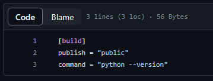
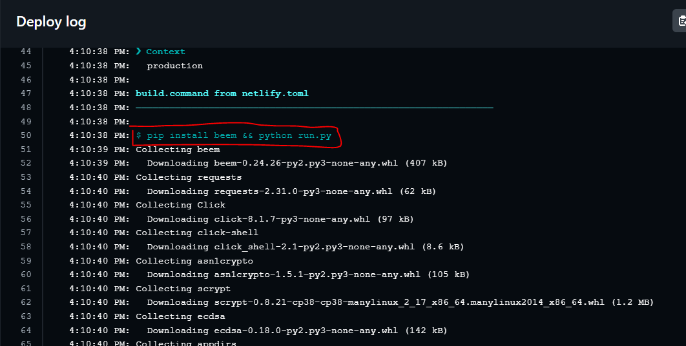
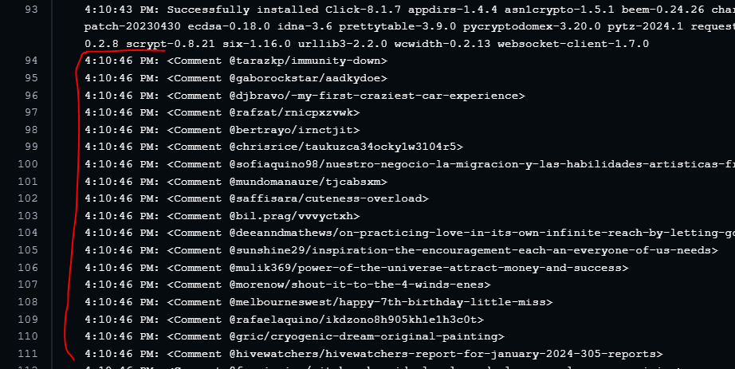
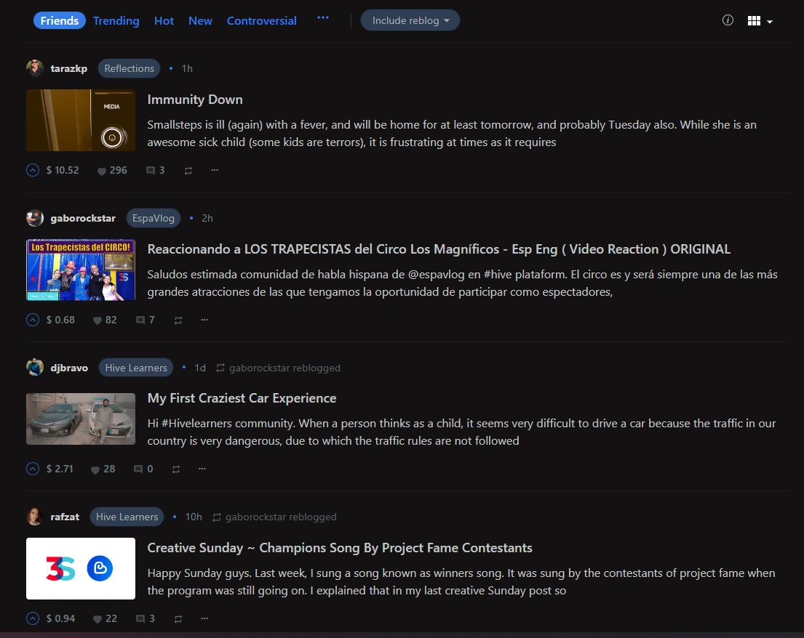

### What is Netlify?

Sometimes you need to upload your code to a Cloud Computing service to showcase your work. Netlify is one such Cloud Computing service. I use Netlify in conjunction with GitHub to display this blog. I upload articles in Markdown to GitHub, and with each push to the repository, it syncs with the repository I have on Netlify. Netlify then runs HUGO to generate the page files you see on this site. Essentially, Netlify takes care of deploying my blog; I just need to push to my GitHub repository, and automatically, after a few seconds (or minutes), the site will be updated.
<!--more-->

I've done this before, but often, when programs update, it can break the workflow you've set up. To avoid that, there are configurations for Netlify that you can specify in your GitHub repository so that when you push, Netlify executes those configurations, and your workflow remains unaffected.

These files need to be placed at the root of your repository with the name `netlify.toml`. If you want, you can check out my configuration file in the repository of this blog by clicking [here](https://github.com/CesarPazzi/blog/blob/master/netlify.toml).

In the configuration file, I've specified that the HUGO version for production should be 0.89.3 because that's the version I'm currently using in my local workflow on my computer (I tried a newer version before, but it didn't run properly, and I never investigated the reason).

I also realized that this configuration file can be tweaked to make Netlify run code either in Python or Bash. In your `netlify.toml` file, you can specify the command to run, as shown in the following screenshot.



As you can see, under `command =`, it's running the command `python --version` to check the installed Python version. You can then verify this in the Netlify repository logs and see the output of the chosen command.

### Tweeking The Config File

This got me thinking; if you can run the command to check the Python version, maybe you can also install libraries. So, I first created a simple Python script with the Beem library, which is used to interact with the HIVE blockchain. The script simply prints the current feed of the specified account, in this case, it's mine: @cronicasdelcesar.

Here is the code in the `run.py` file:

```python
from beem.account import Account
acc = Account("cronicasdelcesar")
for f in acc.get_feed():
    print(f)
```

And this is the Netlify configuration file (`netlify.toml`):

```toml
[build]
publish = "public"
command = "pip install beem && python run.py"
```

Both files are in the root of the GitHub repository, and I push to signal Netlify. In the following [link](./netlifylog.txt), you can see the complete Netlify log showing that it installed the Beem library and executed the `run.py` file from the repository.



And here is where the `run.py` file starts running, where I want it to print my @cronicasdelcesar account feed:



This accomplishes the same as opening the main page of any front-end, in this case, Ecency, which is what I use:



Achieving this, I think we can do many things, especially interactions between your blog and HIVE. An idea that comes to mind is synchronizing your blog posts on HIVE to have certain posts with certain tags to be published on HIVE in specific communities depending on your post configuration. My imagination fly away.
