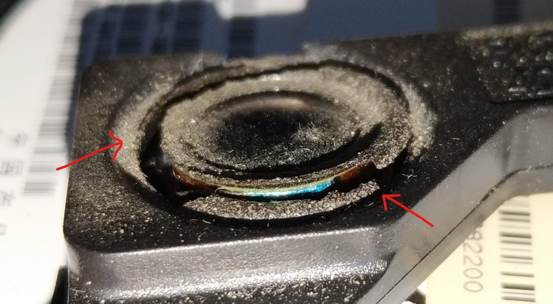
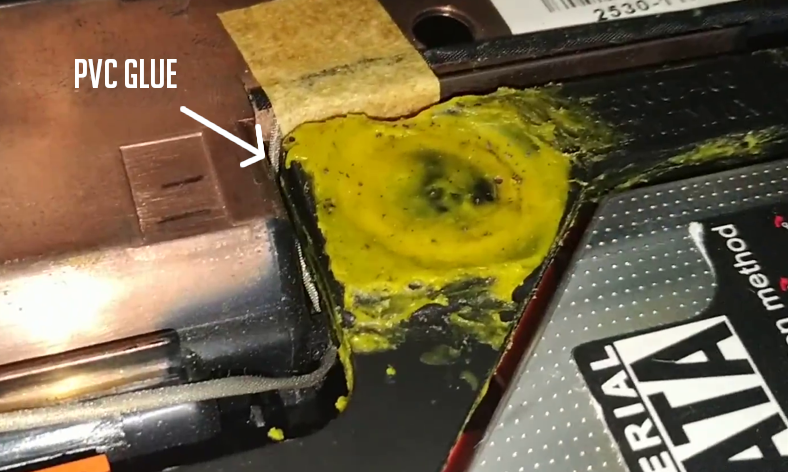
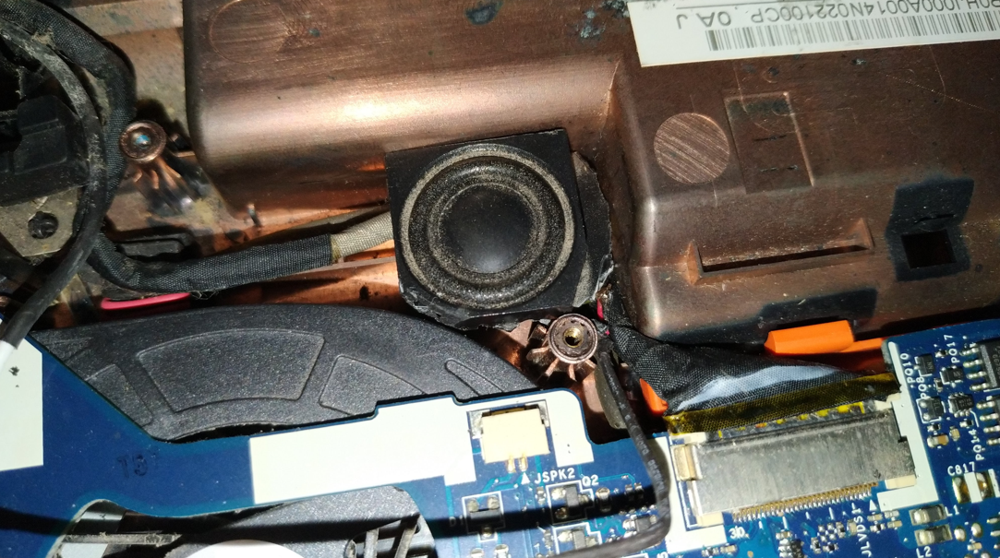
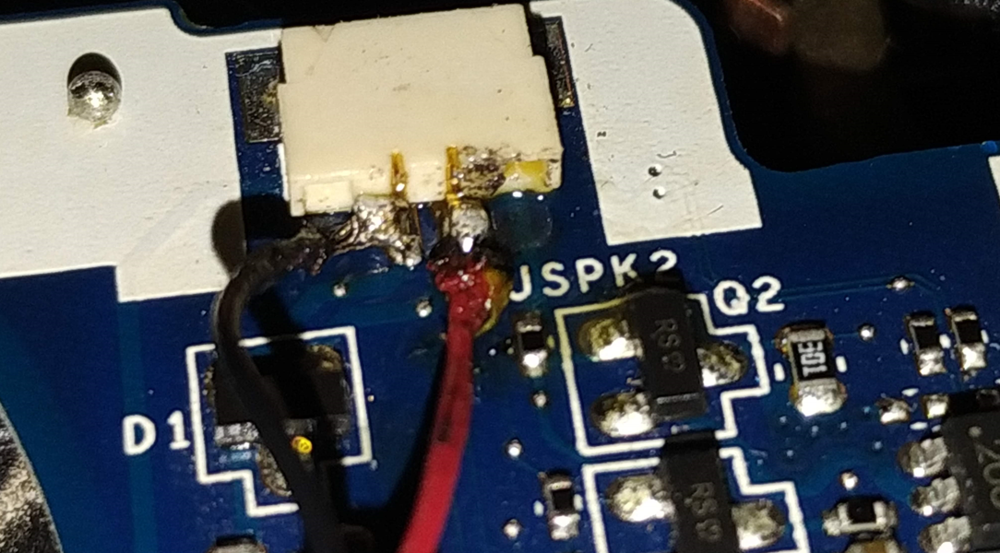
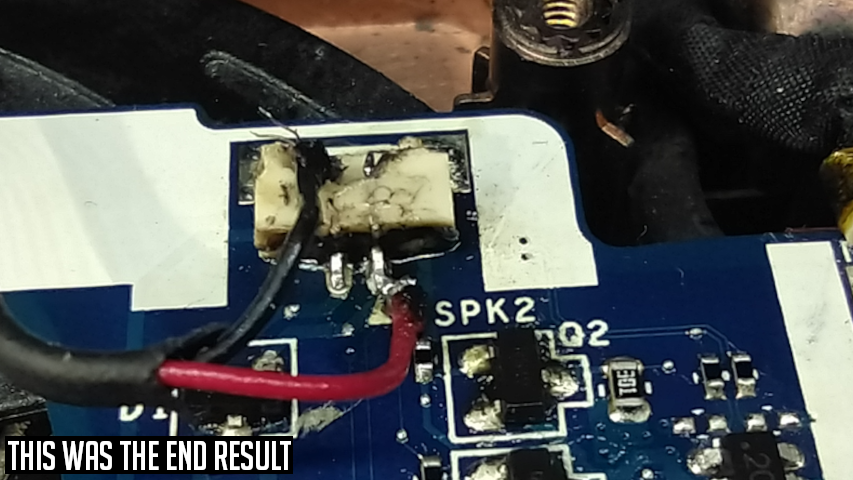

<!--more-->

I have a [Gateway NV57](./nv57-reference.jpg) Laptop, it have a 2nd gen Intel Core i5 with 8GB of RAM (I previously upgraded it), I don't complain, I do all kind of work with this Laptop, even I am writing this post from it. The years have passed over it and have it's failures like the battery charge does not last as before (battery wear), I have to press harder for the keys to register properly, the trackpad does not work flawlessly, sometimes it freezes and had to hard reset (pressing the power button for a couple of seconds), the speakers have some rattling and the list goes on and on.

Today I want to show you how I fixed the rattling on the speakers. Fixing one failure at a time.

## Inspection

First things first. Just to clarify, I could buy the speakers online but that wouldn't be fun at all, so I decided to fix them without spending any money.

The main issue is that the Left speaker is missing because I remove in past maintenances, now the Right speaker start to rattling.

I disassemble the Laptop and found out that the Right speaker have it's cracks causing the rattling. In this particular case, the speaker the coil and connections on the speaker were fine and the only issue was in the woofer cone that was cracked.

## Patching It Up

### Glue It!

In order to "Patch" it, I put some PVC glue on it. This PVC glue is kind of elastic so, it will kind of work making the speaker to vibrate again. I let the glue to dry and it worked as I expected but with a quieter volume.

### Second Hand Speaker

Second, the Left speaker. The Left speaker is missing and damaged so I won't will be using it, I decided that I will be using another's Laptop speaker, from my other old Laptop, a Gateway NV54.

I disassemble the NV54 and found that it is still working, with the exception of the battery, the Laptop needs to be plugged at all times because the battery is dead and it didn't hold charge at all. 

I proceed to select, remove and inspect a speaker, and after checking it with the multimeter I was sure that it was good and I proceed to "mod" the speaker in order to fit on the NV57.

This speaker had a plastic enclosure that fits on the other Laptop (NV54) but not on the NV57. So in order to make it fit on the NV57 I had to use some pliers, sand paper and an X-Acto knife, and after a couple of minutes, it was a near perfect fit on the NV57, but there was another thing to worry about, there was no connector on the speaker.

### Patience, Patience

There was no connector to connect to the motherboard on the speaker wires, so I had to put my soldering skills to the test.

After a couple of hours trying to solder the tiny wires to the tiny pins, I give up and let it alone for the rest of the night.

*(This was causing a short)*

### The Smell Of Soldering Fumes By The Morning

At the next morning, I continue trying to solder the wires until I finally made it. I feel accomplished because I had no microscope, I have to use a LED light tube not proper for this kind of jobs, my hands were not that steady and to make it worse, the tip of my solder iron is not that good, not dull, just not good. 

In the end, I was very happy to finish the work with the little equipment I have at hand, and I played some random song I had on my local drive to test because the Wifi's antennas were not connected at that moment, and both speakers worked just fine, just the Right one with a lower volume but not rattling.

My soldering skills definitely have to improve and I need to stop drinking coffee when I know I will need to solder something to avoid shaky hands.

## Video



.