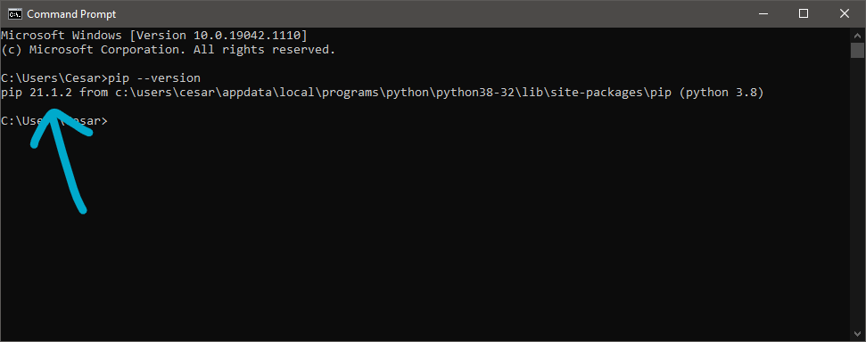
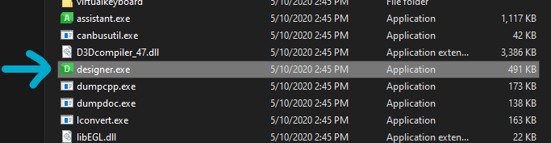
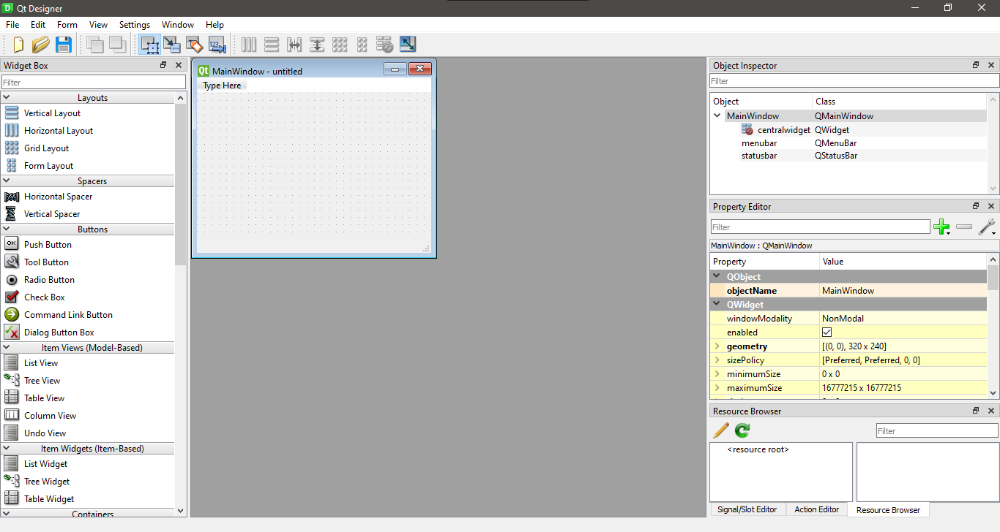

I wouldn't call this a REAL project since I make it in under a day but, I think it deserves a spot under the Projects category because it's a solution for easing my blogging workflow and, I learned one or two things in the process😉. Let's begin.

Practically since I've started to blog with Hugo, I've been searching ways to ease the creation of the post and the workflow in general.

Yesterday I came up with a simple solution for this which is a GUI.

## GUIs

GUI stands for Graphical User Interface and what it does is serves as a visual aid for the manipulation of command line applications. It is the first thing the user sees when opening a program, the interactive part of the program, from the Window itself to the Buttons, Text, Text input boxes, etc. 

Since Python is the programming language I'm learning right now, it would serve me as a way to practice and understand more the language.

## How to make a GUI? 

First, I asked my self the question, how can I make GUIs in Python? The answer, a framework.

### Short definition of Framework

Frameworks are a collection of modules and packages for building applications quicker and easier (most of the times 😅). The framework will handle complicated or tedious processes like for example when using a protocol, you will not need to create your classes or methods for handling the protocol itself.

There are several GUI making frameworks like Tkinter (which is build in Python, so no need to install extra packages/modules) but for now I'm just using PyQt5.

PyQt5 GUIs look nicer than apps build with Tkinter and it also have a Designer tool similar to the XAML designer in Visual Studio making it super easy to design the UI just dragging and dropping controls on the Window(s).

## Installing PyQt5

To start, make sure you have PIP installed, open a command line window and type: 

` pip --version ` 

And you should see something like this:

And to install PyQt5 you will need to type: 

` pip install pyqt5 ` 

And to install the UI designer type: 

` pip install pyqt5-tools `

Once PyQt5 is installed we need to open a File Explorer window and navigate to where pyqt5 and it's tools are installed, in my case it is:

` C:\Users\User\AppData\Local\Programs\Python\Python38-32\Lib\site-packages\pyqt5_tools\Qt\bin `

You will see the file **designer.exe** 

Double click to open it and you will see the Designer and will be able to make your own UI.

Once you are done with your design save it (.ui), open a command line window, change the directory where your .ui is and type `pyuic5 -x yourUIfile.ui -o yourUIfile.py` this will convert your .ui (which is in XML) into Python code.

From there you can just make your functions to interact with the window controls and events.

## My GUI Solution

To wrap things up, I will leave you a screenshot and the code of the GUI for creating my Hugo posts in this gist. This short app require that Hugo.exe is on the Path (Environmental Variables) or at least on the same directory as the app. 

I changed the extension from **.py** to **.pyw** , doing this will prevent opening a command line window and making your app look like a native **.exe** app.

The app will display if the post was created successfully, if the post was already created or if there was another error. After naming your post, you can whether press the Enter (Return) key or press the "Create Post" button to activate the function that create the posts.



