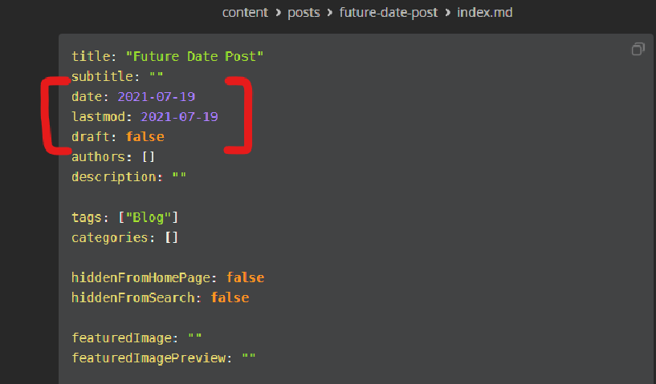
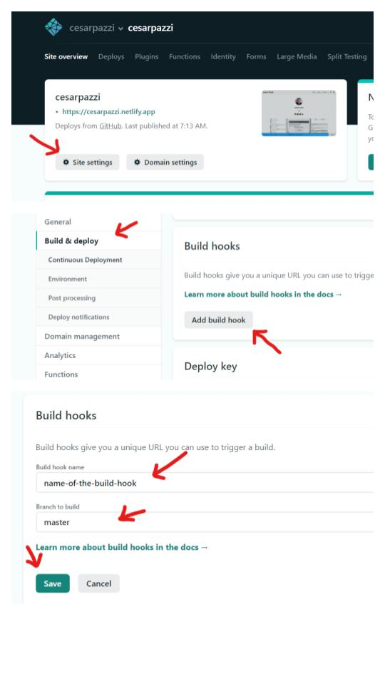
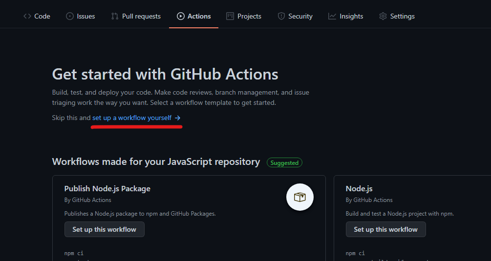
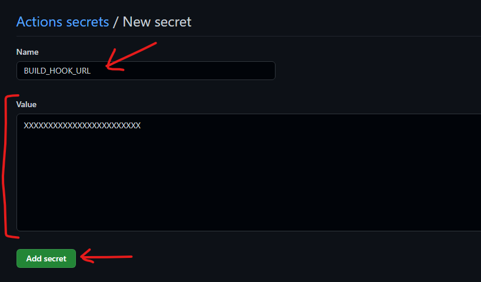

<!--more-->

## Static Sites Are not Dynamic

Static sites have very cool advantages against other type of sites like blazing fast load speeds but also have drawbacks like they are not dynamic and cannot publish posts automatically, so you cannot write multiple posts and leave a couple of days on vacation or something, you have to be there to commit and push the changes to your repository to build/publish the posts, but that's how Static Site Generators work, but, it doesn't mean there are no ways to achieve this.

### No Schedule Post For You

As I said before, Static Site Generators like Hugo does not schedule posts because the server that hosts your site/files does not run the Hugo app like a deamon waiting for changes to build the site. Sure, you can set the date to a date in the future in the Front Matter's `date` variable but Hugo does not build these pages and if you set the `--buildFuture` option on the `netlify.toml` configuration file it will build your future posts but it will make them available right away, so no schedule posts build in, that's why we need some type of tool for automation.



## Make Them Dynamic

GitHub Actions allows to run commands at a certain given interval of time and the way to do is with `cron`. Now, GitHub does not let you run `cron` [like in a Unix/Linux environment](https://www.cyberciti.biz/faq/how-do-i-add-jobs-to-cron-under-linux-or-unix-oses/) would run, but you can leverage it to make what you want. But how exactly will GitHub Actions would make this possible? May you ask...

Netlify have a tool called "[Build Hooks](https://docs.netlify.com/configure-builds/build-hooks/)", what it does is to setup an URL to trigger a build and deploy of your site. So, whenever you want, you can go to the Build Hook URL and it will trigger the build action configured in your `netlify.toml` file inside your repository and to build your Hugo site as it would do if you commit on the GitHub repository. But make sure your posts have the `draft:` variable set to `false`.

### Hook On

OK, first setup the Build Hook URL which is pretty easy, just follow the instructions on the Netlify documentation about [Build Hooks](https://docs.netlify.com/configure-builds/build-hooks/). But to simplify, go to **Site Settings > Build & Deploy** and scroll down to **Build hooks**, click on **Add build hook**, name it, select branch (in case you have multiple) and click on **Save**. 



You will end with a URL something like this:

`https://api.netlify.com/build_hooks/XXXXXXXXXXXXXXXXXXXX` 

From here you can access this URL from any browser or with `curl` from the terminal and you will be able to run the build command to build your site at a given time.

### Let's Get Actions

Now, go to your site repository in GitHub and click on the Actions tab and if you don't have any Actions on the repository, you will see a similar page like this:



Click on set up a workflow yourself link and will take you to the creation page of a new file.

From there you can edit the name of the Action itself, when it will trigger the Action, the Job(s) name(s) and commands to perform when the Action is triggered. For the purpose of this "Tutorial", we want to trigger the Action at the same time every day (let's make it at 12am Central Time every day), and it will run the command `curl` to trigger the Build hook on Netlify. Once you are done messing around with the file, press on the "Start commit" green button, set a comment and commit the file.

This is the code of my GitHub Action file:

```yaml
name: Daily Build
on:
  schedule:
    - cron: "0 5 * * *"

jobs:
  build:
    runs-on: ubuntu-latest

    steps:
      - uses: actions/checkout@v2

      - name: Netlify Build
        env:
          NETLIFY_URL: ${{ secrets.BUILD_HOOK_URL }}
        run: curl -s -X POST "https://api.netlify.com/build_hooks/$NETLIFY_URL"
```

## Explaining The Action

OK, I will try to explain the logic behind the Actions configurations file as best I can.

```yaml
name: Daily Build
on:
  schedule:
    - cron: "0 5 * * *"
```

First, is the name of the Action and how will trigger the Action, in this case is triggered on `schedule`.

The `cron` command is defined by *crontab* and each number represents an interval of time and if you don't want to get more confused you can go to [Crontab.guru](https://crontab.guru/) to make your own schedule. And timezone on GitHub servers is UTC.

```yaml
jobs:
  build:
    runs-on: ubuntu-latest

    steps:
      - uses: actions/checkout@v2
```

Now, here we define the OS environment the current job will be running, in this case is Ubuntu but we can setup Windows and MacOS, just remember the limitations of each OS and the build in commands.

The line `- uses: actions/checkout@v2` is a requirement for running Actions.

```yaml
      - name: Netlify Build
        env:
          NETLIFY_URL: ${{ secrets.BUILD_HOOK_URL }}
        run: curl -s -X POST "https://api.netlify.com/build_hooks/$NETLIFY_URL"
```

`- name: Netlify Build` is the name of the job we will be running, this is in case we have more jobs to run like Tests that will run a set of commands and then if they passed it will run another job, but in this case we will only run one job and the name will be "Netlify Build".

`env` will set OS environmental variables, and in this case it will only setup one variable called `NETLIFY_URL` with the value of `${{ secrets.BUILD_HOOK_URL}}` which is another variable that will define in the Settings of the repository later.

And finally the command we will be running `curl`. If you see the line URL ends with the same variable we define in the previous line, this is because if your repository goes public the Build hook URL will be exposed and anyone will be able to sent the build command on your Netlify site. 

## Secrets, Secrets

Sometimes our scripts or apps require tokens in order to work, but, that tokens are meant to be private, because if anyone will know about them they will control our app or account. 

To give you an example, in my Twitter Weather Bot project, the Twitter API give me my set of tokens to be able to tweet to my account, if anyone will know this tokens, they will be able to tweet as if it was me, and this is a huge security issue. That's why we don't want to put the tokens on the repository itself when anyone can scrape or know about our tokens, and we can avoid doing this with GitHub secrets.

To define a secret we need to go to our repository **Settings > Secrets** and press the **New repository secret**. Give it the name of `BUILD_HOOK_URL` which is the name we give it on the `schedule.yml` file we generate, and in the Value field just put the last characters of the Build hook URL of the Netlify site, click on Add secret and you are done. The `schedule.yml` will be able to access your secret and will run as intended.



## Write And Forget

After setting all this, you just have to write your posts with a future date, set the post to `draft: false` and every day at 12am Central Time the GitHub Action run in the background and Netlify will publish as if you were in front of the computer commiting the changes.