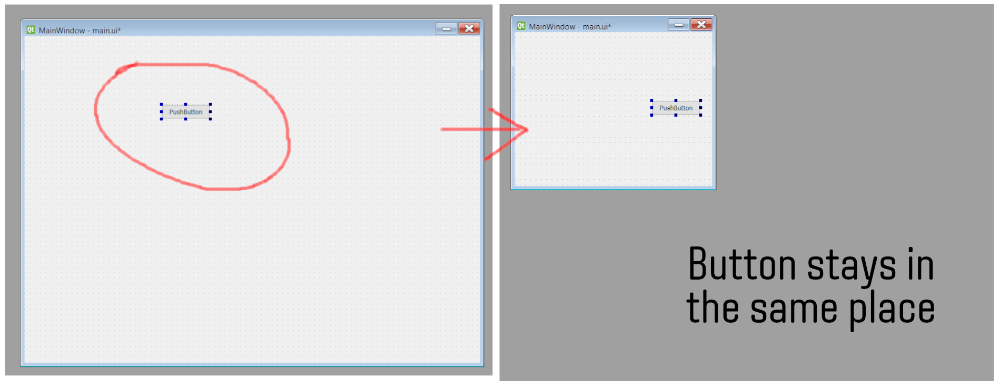

<!--more-->

There is no doubt that you cannot rely on your own memory to remember things. Let me tell you what happened.

Today I decided to make a UI for a new project that I have, where I will be using Python (as usual) for programming and QT Designer for the UI as I do on my previous project called Hive Block Explorer which it have a Responsive UI. 

Let me explain you what is Responsive Design in short terms: It is, whenever you resize the window, it will resize the controls, texts and buttons to maintain proportions or align them accordingly the window size. So when you resize the window in a portrait size, the texts, controls, etc. will align in some way for you to view them easily without scrolling through the window as possible..

Well, the point is that despite the work I have done on that project, I couldn't remember exactly how I achieve a Responsive Design. 

That's why In this post we will see how we can make windows with Responsive Design in QT Designer.

First, open QT designer and create a new empty window, I will call it `main.ui`.

For this example I will delete the Menu and Status Bars located in the top and bottom parts of the window.

Let's place a button or any control you want. Notice that whenever you resize the window the button will stay in the same place.

Now we will have to right click in any part of the window that does not have a control, let say on the background of the window, select "Lay out" and "Lay out in a Grid" to see how the button aligns accordingly when you resize the window.

 

Let's see how the button stretches along with the containing window.

If you want to better distribution, you can use the Layouts widgets on the left of the screen to make a Grid based layout with Vertical, Horizontal or Form Layouts and nest them together to shape the window in any way you want. 

 

Sometimes the solution is hiding in plain sight, you just have to figure it out where to find it.

With this post I'll hope to remember how can achieve Responsive Design on QT Designer. 