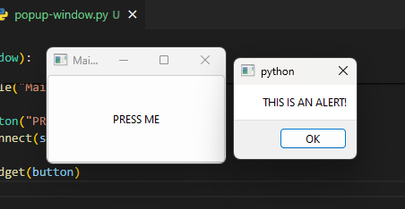

<!--more-->

In my continuous path to learn something new every day, I decided to learn a little bit more about GUIs using Python (my language of choice) and I came a cross this video titled "Learn Python GUI Development for Desktop – PySide6 and Qt Tutorial" from freeCodeCamp.org (you can watch it [here](https://youtu.be/Z1N9JzNax2k?si=XGvYNTfjW-mDLmTn&t=414https:/) on YouTube).

Something stuck in my mind which was the comparison between PySide6 and PyQT (which at this time I have more experience, you can tell checking my other posts in this blog), in this comparison, the author points out that if you use PyQT in your application you will need to purchase a licence in case your application is for business purposes, and the fact that PySide6 is being developed under the official QT project, so it has more future than other frameworks that uses QT.

Knowing that, I decided to learn PySide6 but first I wanted to change all my work done (which is not a lot) from PyQT to PySide6, and to make it quick and easier I decided to use AI (Artificial Intelligence) to make it done in a matter of minutes, but it is a little bit tedious copying and pasting into the file for testing.

So I remember that I have Github Copilot activated a couple of weeks ago in my work account but I never used because lately I didn't have any programming project ongoing and right now I am on holiday vacations I can give Github Copilot a try 😉.

First, because I will be using copilot into VS Code I had to install the following extensions which were "GitHub Copilot" and "GitHub Copilot Chat", one is for generating code in editor and other is for more "Chat" like experience.

When you install the extensions, a "Chat" button will appear at the left side panel (marked with a red arrow) and after pressing it a side bar will appear with the text box input for the chat, in there you can ask questions about a specific library in the internet (does not have be installed in your system), questions about your code in the currently opened file, or any other programming related questions you may have. In the above image I am showing you the recently opened side bar from my Hive Block Explorer project, in the red square there are a couple of suggestions related to the code opened like fixing, testing or explaining the code from the file opened.

In the image above I am showing you what Copilot came up when asked to explain the code from the Hive Block Explorer project, that we know that is just basically a window done using QT to get requests from the Hive blockchain (using JSON). The explaination is OK for my taste, that the end of the explanation is referring PyQT which I did change for PySide6 when I took that screenshot.

The other function that give GitHub Copilot is to generate code while in the editor by pressing Ctrl + I , it will popup a small text box asking for what you want to generate. 

After you press the arrow button it will generate code in a green like background (see picture below) and then you can Accept, Discard or Regenerate code.

In this case, I accept the code and ran it to see if it was accurate and it delivers fine😊, although the button is way too big but that's because of the default sizes which are not specified.

Once I done the practice and check that Copilot does indeed works fine I proceed to change the code from PyQT to PySide6 which was done in a an hour or less because Copilot is not perfect or does not understand you 100% and will sometimes give you code that have bugs, but with a little bit of logic and knowledge you can fix in a matter of minutes and that will save you a ton of time instead of asking the internet and probably distracting you for achieving your wanted results.
