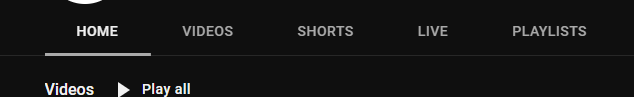
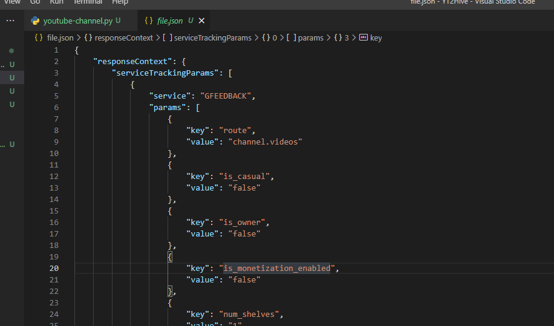

<!--more-->

It's been almost a year since my last post, but lately and thank God, I was able to get a Job that truly uses my potential as an engineer. Anyway, I am writing this to tell you a little bit of the process on how I take the problem I am having, which is to auto post my YouTube videos to HIVE, the web3 social media site.

## Problem Statement

First, it is very time consuming to create a video, from the subject thinking on what you want to transmit, the editing and the details and tags of each video over YouTube.

While I don't earn an income off of YouTube, I need to post my videos directly to HIVE and doing this manually is a pain to earn a little crypto off my work.

That's why is a problem for me, problem I want to tackle and fix with a little bit of programming and I feel comfortable using Python, that's why I still be using it to solve this problem.

## Getting The Videos

I previously wrote code and where I use Beautiful Soup for getting pages from the internet so this time will not be different.

As of now, there's been like 2 or 3 months since YouTube change the layout of the channels separating Videos from Shorts and Streams via tabs, so the previous code would not work but can be used as reference.



Besides the libraries I started by defining the URL of the channel and later concatenating with the remaining part for Videos, Shorts and Streams.

```python
yt_channel = "https://www.youtube.com/@t0xicgh0st"
yt_videos = yt_channel + "/videos"
yt_shorts = yt_channel + "/shorts"
yt_streams = yt_channel + "/streams"
```

After defining the URLs, we need to make a request to the URL we want to get the videos, in this case I will use the the variable `yt_videos` to get only the videos of the channel.

I start to use Beautiful Soup with the text of the response (`response.text`) and parsing it with the html5 parser.

Beautiful Soup will create an object (Bs) and use it's method `find_all` to find all the tags which contain the tag ***body*** and I use again the `find_all` method to find the ***script*** tags.

At this point, we don't know what we are capturing and because of this I temporally save the output to a file in which I can inspect it in detail, for this I used the following code:

```python
with open("file.json", "w", encoding="utf-8") as file:
     file.write(str(scripts[13].string[20:-1]))
     file.close()
```

I open the file in VS Code and with the ```json``` extension installed I was able to format the file and make it more readable.



And VS Code will show you the JSON path your cursor is currently at and with this I was able to get to the key I want which are the VideoID and the Title of the video.

I will wrap things here as I not done writing all the code. See you soon... I hope so 😏.