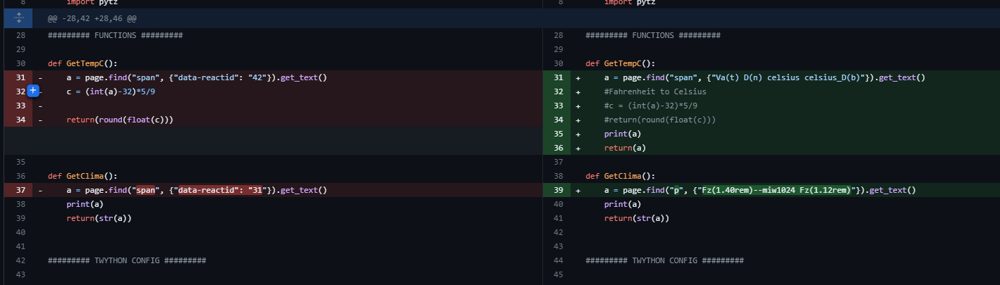
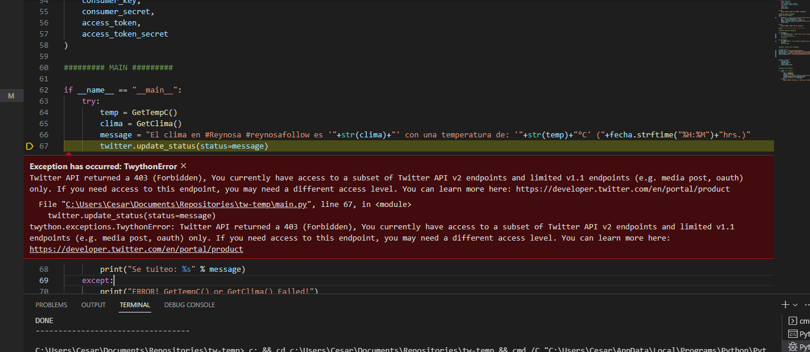

<!--more-->

It's been a long time since I update my weather script, in fact, I didn't noticed that the bot for tweeting the weather and the temperature to my Twitter profile was not working, well... only the part for sending the tweet, and this was since February to my surprise😱.

After I debug the script I noticed that acquiring the data from the Yahoo Weather page was broken so the Twitter part.

Yahoo Weather change the internal layout of the page and that brake the first part of my script. They were using a span class for the Fahrenheit that I grabbed from there the text which was a string and then I transformed into an integer to later convert it to Celsius. Now it is much simpler because the span class give you the temperature in Celsius so I won't have to do any conversion.

And for the tweet part of the script. I noticed that after fixing the weather acquisition data from Yahoo's page, I started to get 403 error when trying to send a tweet via the API with Twython module.

I attribute this error to Twitter's marketing of the API that only left a few options for free users, luckily sending tweets is part of the free plan as long as I won't send more than 3,000 tweets per month that is more than enough (I will send more or less 720 tweets per month).

But in fact I was wrong, it was because of the [Twython](https://github.com/ryanmcgrath/twython/) module. So after a good hour of trying to make it work, I decided to give [Tweepy](https://www.tweepy.org/) a try and worked in the fist try. Currently Twython is not maintained by his creator and for his comment in an [open issue](https://github.com/ryanmcgrath/twython/) in this Github repo and from what I understand he's not thinking in maintaining it but from his reply to me, he's open for maintainers and Pull Requests (PR).

As of now, my weather script is running just fine with Tweepy but still looking forward to implement the database for historical data or the Hugo integration [that I previously talked about](/tw-temp/).